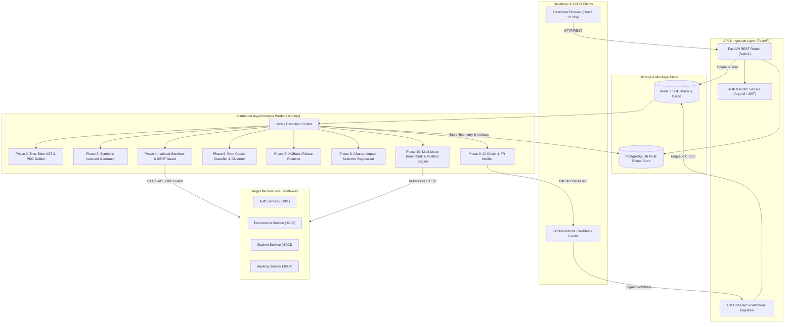
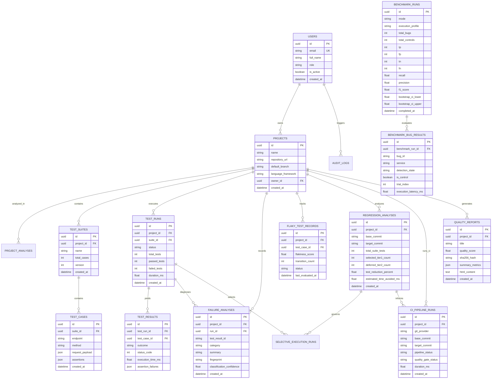
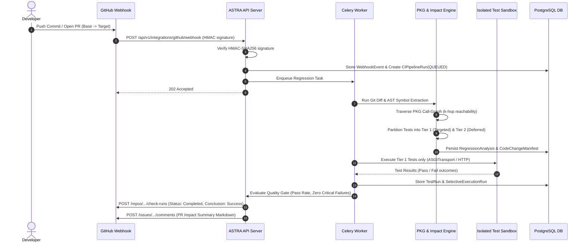
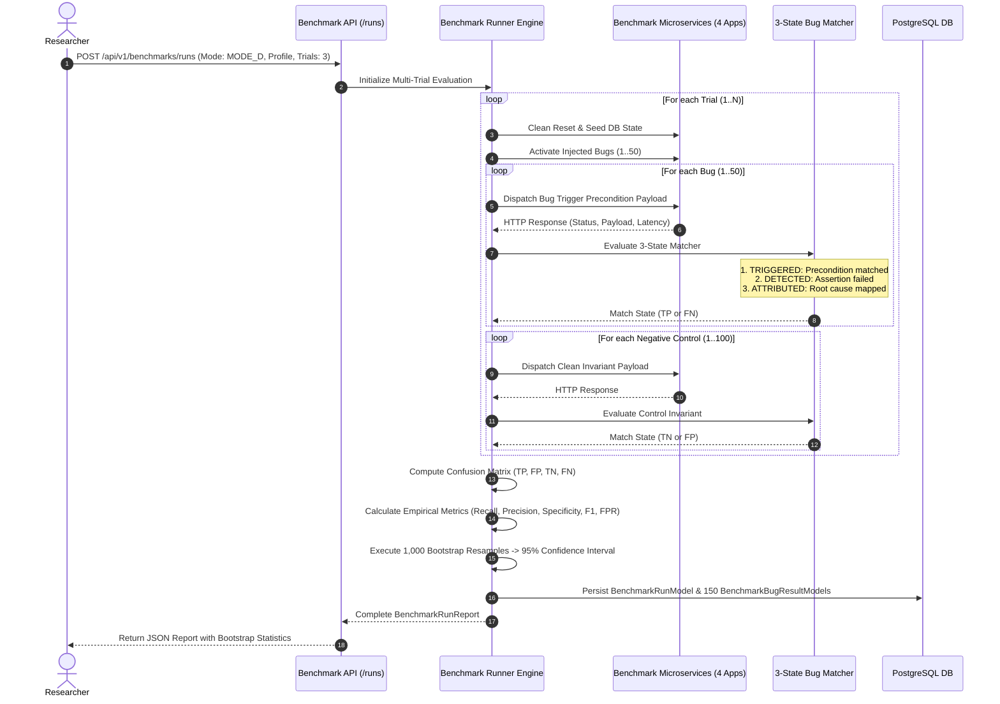

# ASTRA: Complete System Architecture & Engineering Diagrams

**Project Title**: ASTRA — Autonomous Software Testing, Regression Analysis & Defect Attribution Platform  
**Academic Document**: Final Viva Technical Reference & System Architecture Specification  
**Version**: 1.0 (Phase 1–10 Complete)

---

## 1. System Overview & Technology Stack

ASTRA is an enterprise-grade, autonomous software quality engineering and empirical evaluation platform designed for modern microservice architectures. It integrates deterministic AST static analysis, Program Knowledge Graphs (PKG), synthetic invariant test generation, machine learning failure prediction, change-impact selective regression, CI/CD pipeline automation, and multi-mode benchmark evaluation.

### Core Technology Stack

| Layer | Technologies & Frameworks | Key Responsibilities |
|---|---|---|
| **Frontend** | React 18, TypeScript, Vite, Tailwind CSS, Lucide Icons, Zustand | Real-time reactive dashboards, quality scorecards, ablation matrix, bug traceability drilldown. |
| **API Backend** | FastAPI, Python 3.11, Pydantic V2, SQLAlchemy 2.0 (Async), Uvicorn | REST APIs, authentication (Argon2 + JWT), transaction management, query aggregation. |
| **Execution Engine** | Celery 5.3, Redis 7, SQLite memory transport, ASGITransport, Docker SDK | Asynchronous task workers, isolated test runners, deterministic AST parsing. |
| **Data & Storage** | PostgreSQL 16 (asyncpg), Alembic, Redis 7 (broker & result backend) | Persistent domain storage, historical telemetry, flakiness tracking, report artifacts. |
| **Intelligence Layer**| NetworkX (PKG graph), XGBoost, Scikit-learn, ReportLab, Weasyprint fallback | Graph reachability, ML test prioritization, PDF/HTML executive report synthesis. |

---

## 2. End-to-End System Architecture

---

## 3. Entity-Relationship Diagram (ERD)

The relational schema spans all 10 project milestones, enforcing strict cascading deletes, foreign key indices, and temporal auditing.

---

## 4. Sequence Diagrams

### 4.1 Selective Regression Pipeline (Phase 8 & 9)

### 4.2 Benchmark Empirical Ablation Study (Phase 10)

---

## 5. Security Architecture & SSRF Guard

ASTRA implements defense-in-depth isolation across all execution pathways:

1. **SSRF Guard**: All outbound synthetic HTTP test requests pass through an invariant IP address validator (`engine/execution/ssrf_guard.py`) that strictly prohibits private IPv4/IPv6 ranges (`10.0.0.0/8`, `172.16.0.0/12`, `192.168.0.0/16`, `127.0.0.0/8`, `169.254.0.0/16` AWS metadata) unless explicitly whitelisted for local container sandboxes.
2. **Secret Redaction**: Test payloads and server logs undergo regex masking for API tokens, Bearer tokens, private keys, and passwords before database persistence.
3. **HMAC Webhook Verification**: GitHub webhooks are validated using constant-time `hmac.compare_digest` with SHA-256 against secret tokens.
4. **Report Sanitization**: Executive audit HTML artifacts sanitize all user-supplied project names and titles, escaping `<script>`, `onerror`, and XSS injection vectors.
