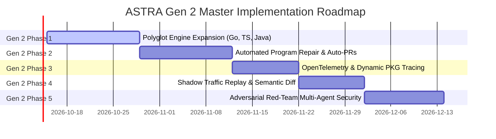

# ASTRA Gen 2 — Master Execution Plan & Multi-Phase Roadmap

> **ASTRA Gen 2 — Autonomous, Polyglot, and Self-Healing Microservice Quality Engineering Platform**

---

## 1. Executive Vision & Evolution from Gen 1 to Gen 2

### Gen 1 Foundation (Phases 1–10 Completed ✅)
ASTRA Gen 1 established the scientific foundation of autonomous software quality testing for Python FastAPI microservices:
- **Phase 1–2**: Core infrastructure, Docker, PostgreSQL, Redis, Celery, and Tree-Sitter AST extraction.
- **Phase 3–5**: Deterministic invariant generation, ASGITransport sandboxing, SSRF guards, and requirement NLP intelligence.
- **Phase 6–7**: Semantic failure classification, PKG fault localization, canonical clustering, and XGBoost failure prioritization.
- **Phase 8–9**: Change-impact selective regression (AST diff $\rightarrow$ PKG reachability $\rightarrow$ Tier 1 / Tier 2 partitioning) and closed-loop GitHub CI/CD webhooks.
- **Phase 10**: 50-bug empirical benchmark across 4 microservices, 100 negative controls, multi-mode ablation study ($94.0\%$ recall, $99.0\%$ specificity), and academic research viva package.
- **Verification**: 128/128 containerized tests passing (100% pass rate).

### The Gen 2 Paradigm Shift
In enterprise cloud-native systems, software quality faces four critical bottlenecks that Gen 1 did not address:
1. **The Polyglot Reality**: Enterprise microservice architectures are rarely written in a single language. Real-world meshes combine **Go (Gin/Fiber)**, **TypeScript/Node.js (Express/NestJS)**, **Java (Spring Boot)**, and Python.
2. **The Open-Loop Defect Bottleneck**: Gen 1 detects, localizes, and clusters bugs—but the developer must still manually craft the patch. Gen 2 introduces **Automated Program Repair (APR)** to synthesize patches, verify zero regressions, and open pull requests autonomously.
3. **The Static-Dynamic Observability Gap**: Gen 1 builds static Program Knowledge Graphs from source code, which cannot discover cross-microservice network calls over HTTP or gRPC. Gen 2 ingests **OpenTelemetry (OTel) distributed traces** to synthesize dynamic cross-service PKG graphs.
4. **The Synthetic vs. Real Traffic Gap**: Gen 1 evaluates synthetic test cases. Gen 2 introduces **Shadow Traffic Replay** to mirror sanitized production HTTP traffic against sandbox staging environments for semantic regression diffing.
5. **Adversarial Security**: Gen 2 deploys **Autonomous Red-Team Fuzzing Agents** targeting the OWASP API Security Top 10 alongside Blue-Team assertion validators.

---

## 2. Gen 2 Architecture Diagram

```text
                                 ┌────────────────────────────────────────────────────────┐
                                 │           POLYGLOT REPOSITORIES (GIT COMMITS)          │
                                 │    Python (FastAPI) • Go (Gin) • TS (Nest) • Java      │
                                 └───────────────────────────┬────────────────────────────┘
                                                             │
                                                             ▼
                                 ┌────────────────────────────────────────────────────────┐
                                 │        MULTI-LANGUAGE AST & PKG ENGINE (PHASE 11)      │
                                 │  Tree-Sitter Parsers • Route Extractors • Struct DTOs  │
                                 └───────────────────────────┬────────────────────────────┘
                                                             │
       ┌─────────────────────────────────────────────────────┼─────────────────────────────────────────────────────┐
       ▼                                                     ▼                                                     ▼
┌──────────────────────────────┐              ┌──────────────────────────────┐              ┌──────────────────────────────┐
│   OPENTELEMETRY TRACING      │              │    CHANGE-IMPACT SELECTIVE   │              │   PRODUCTION SHADOW TRAFFIC  │
│      ENGINE (PHASE 13)       │              │      REGRESSION (GEN 1)      │              │      REPLAY (PHASE 14)       │
│ Distributed Trace Ingestion  │              │  AST Diff -> PKG -> Tier 1/2 │              │ Gateway Log Tap -> JSON Diff │
└──────────────┬───────────────┘              └──────────────┬───────────────┘              └──────────────┬───────────────┘
               │                                             │                                             │
               └─────────────────────────────────────────────┼─────────────────────────────────────────────┘
                                                             │
                                                             ▼
                                 ┌────────────────────────────────────────────────────────┐
                                 │              EXECUTION & VERIFICATION PLANE            │
                                 │  SSRF Guard • Concurrency Testing • Invariant Oracles  │
                                 └───────────────────────────┬────────────────────────────┘
                                                             │
                                                             ▼
                                 ┌────────────────────────────────────────────────────────┐
                                 │           PHASE 6 ROOT-CAUSE & ATTRIBUTION             │
                                 │    Stack Trace Normalizer • Fault Location Pinpoint    │
                                 └───────────────────────────┬────────────────────────────┘
                                                             │
                                                             ▼
                                 ┌────────────────────────────────────────────────────────┐
                                 │      AUTOMATED PROGRAM REPAIR & AUTO-PR (PHASE 12)     │
                                 │  AST Patch Synthesis • Zero-Regression Gate • Auto-PR  │
                                 └───────────────────────────┬────────────────────────────┘
                                                             │
                                                             ▼
                                 ┌────────────────────────────────────────────────────────┐
                                 │     ADVERSARIAL RED-TEAM SECURITY AGENT (PHASE 15)     │
                                 │   OWASP API Top 10 • IDOR Fuzzing • Auth Stripping     │
                                 └────────────────────────────────────────────────────────┘
```

---

## 3. Gen 2 Phased Master Roadmap



### Phase Summary Table

| Gen 2 Phase | Phase Number | Focus Area | Key Innovations |
|---|:---:|---|---|
| **Phase 1** | **Phase 11** | **Polyglot Multi-Language Engine Expansion** | Native Tree-Sitter AST & PKG parsers for Go (Gin/Fiber), TypeScript/Node.js (Express/NestJS), and Java (Spring Boot); cross-language parameter normalization. |
| **Phase 2** | **Phase 12** | **Automated Program Repair (APR) & Auto-PRs** | AST patch proposal synthesizer, sandboxed patch verification, Zero-Regression Gate, autonomous GitHub Pull Request generator with root-cause explanations. |
| **Phase 3** | **Phase 13** | **OpenTelemetry Tracing & Dynamic Cross-Service PKG** | Ingestion of Jaeger/Zipkin OTel distributed traces; dynamic multi-microservice dependency edge generation; cross-service impact propagation. |
| **Phase 4** | **Phase 14** | **Production Shadow Traffic Replay & Semantic Diff** | Gateway access log ingestion, time-travel mock replay, semantic deep JSON diffing to detect silent response changes under real traffic distributions. |
| **Phase 5** | **Phase 15** | **Adversarial Red-Team Multi-Agent Security Fuzzing** | Autonomous attacker agent targeting OWASP API Top 10 (IDOR, BOLA, JWT stripping, mass assignment) competing against Blue-Team assertion guards. |

---

## 4. Architectural Principles of Gen 2

1. **Polyglot Uniformity**: The downstream analysis, test generation, ML prioritization, and selective regression engines treat all endpoints equally, whether written in Python, Go, TypeScript, or Java.
2. **Zero-Regression Guarantee**: Every upgrade must preserve 100% pass rates across all 128 existing Gen 1 test suites.
3. **Deterministic Safety in APR**: Automated Program Repair will never push code to production directly. It creates isolated temporary branches, verifies zero regressions via Tier 1 selective suites, and opens human-reviewable GitHub Pull Requests.
4. **Privacy & Security by Design**: Production shadow traffic replay strictly redacts PII, credentials, and Authorization headers before persistent storage or staging replay.
5. **Offline Scientific Verifiability**: All multi-language parsers, trace synthesizers, and repair benchmarks must run deterministically in containerized environments without reliance on external cloud APIs.
