# Gen 2 — Phase 1: Polyglot Multi-Language Engine Expansion Implementation Guide

> **Module Focus:** Tree-Sitter AST & PKG Parsers for Go (Gin/Fiber), TypeScript/Node.js (Express/NestJS), and Java (Spring Boot); Universal Route Extraction; Cross-Language Selective Regression.  
> **Generation / Phase:** Gen 2 — Phase 1 (Phase 11 of Master Architecture)  
> **Status:** Planning & Architectural Specification

---

## 1. Language Support Architecture in ASTRA

ASTRA interacts with software systems across three distinct technical layers:

```text
┌────────────────────────────────────────────────────────────────────────────────────────┐
│                      LAYER 1: DYNAMIC BLACK-BOX EXECUTION (HTTP/REST)                  │
│  Universal Support: Any language exposing HTTP (Go, Python, Java, Node, Rust, C#, etc.)│
│  Capabilities: SSRF Guards, Schema Invariants, Latency SLAs, Status Assertions        │
└───────────────────────────────────────────┬────────────────────────────────────────────┘
                                            │
┌───────────────────────────────────────────▼────────────────────────────────────────────┐
│                  LAYER 2: FAILURE ANALYSIS & DIAGNOSTICS (PHASE 6)                     │
│  Supported Runtimes: Python Tracebacks, Node.js V8 Stacks, Java JVM Stacks, SQL Codes  │
│  Capabilities: Exception classification, root-cause frame extraction, fingerprinting   │
└───────────────────────────────────────────┬────────────────────────────────────────────┘
                                            │
┌───────────────────────────────────────────▼────────────────────────────────────────────┐
│             LAYER 3: WHITE-BOX AST STATIC ANALYSIS & KNOWLEDGE GRAPHS (PKG)            │
│  Gen 1 Status: Python FastAPI & Flask only (Native Tree-Sitter + AST)                  │
│  Gen 2 Upgrade: Elevate Go, TypeScript/Node.js, and Java to Full Native Equality!      │
└────────────────────────────────────────────────────────────────────────────────────────┘
```

### Detailed Language & Framework Support Matrix

| Subsystem / Capability | Python | Go (Gin / Fiber) | TypeScript / JS (Express / Nest) | Java (Spring Boot) | Other (Rust, C#, PHP) |
|---|:---:|:---:|:---:|:---:|:---:|
| **Black-box HTTP Testing & Invariants** | **Full** ✅ | **Full** ✅ | **Full** ✅ | **Full** ✅ | **Full** ✅ |
| **Framework & Language Auto-Detection** | **Full** ✅ | *Phase 1 Target* 🎯 | *Phase 1 Target* 🎯 | *Phase 1 Target* 🎯 | Detects as `OTHER` |
| **Exception & Stack Trace Parsing** | **Full** ✅ | *Phase 1 Target* 🎯 | **Full** ✅ | **Full** ✅ | Generic regex |
| **AST Parsing & Parameter Extraction** | **Full** ✅ | *Phase 1 Target* 🎯 | *Phase 1 Target* 🎯 | *Phase 1 Target* 🎯 | Roadmap |
| **Program Knowledge Graph (PKG Call Graph)** | **Full** ✅ | *Phase 1 Target* 🎯 | *Phase 1 Target* 🎯 | *Phase 1 Target* 🎯 | Roadmap |
| **Git AST Diff Selective Regression** | **Full** ✅ | *Phase 1 Target* 🎯 | *Phase 1 Target* 🎯 | *Phase 1 Target* 🎯 | Roadmap |

---

## 2. Technical Specifications by Target Language

### 2.1 Go (Gin & Fiber Frameworks)
- **Manifest Detection**: Inspect `go.mod` for `github.com/gin-gonic/gin`, `github.com/gofiber/fiber`, and `github.com/go-chi/chi`.
- **AST Parsing Engine**: `engine/analyzer/parsers/go_parser.py`.
- **Route Patterns**:
  ```go
  // Gin Direct Registration
  r.GET("/api/v1/users/:id", GetUserHandler)
  r.POST("/api/v1/orders", CreateOrderHandler)

  // Gin Route Group Prefix Resolution
  v1 := r.Group("/api/v1")
  {
      auth := v1.Group("/auth")
      auth.POST("/login", LoginHandler) // -> /api/v1/auth/login
  }
  ```
- **Parameter & Model Extraction**:
  - Path variables: `:id` or `*filepath` extracted into `location = "path"`.
  - Struct bindings: Parse Go struct fields and struct tags:
    ```go
    type OrderRequest struct {
        ItemID   string  `json:"item_id" binding:"required"`
        Quantity int     `json:"quantity" binding:"min=1,max=100"`
        Price    float64 `json:"price" binding:"gt=0"`
    }
    ```
  - Yields normalized Pydantic-compatible field validation schemas for synthetic test generation!

### 2.2 TypeScript / JavaScript (Express & NestJS)
- **Manifest Detection**: Inspect `package.json` dependencies for `express`, `@nestjs/core`, and `fastify`.
- **AST Parsing Engine**: Upgrade [`javascript.py`](file:///d:/Astra/engine/analyzer/parsers/javascript.py) and [`typescript.py`](file:///d:/Astra/engine/analyzer/parsers/typescript.py) from stubs to full AST parsers.
- **Express Patterns**:
  ```typescript
  // Express router
  const router = express.Router();
  router.get('/products/:productId', getProduct);
  router.post('/checkout', validate(CheckoutSchema), processCheckout);
  app.use('/api/v2', router); // Prefix inheritance -> /api/v2/products/:productId
  ```
- **NestJS Decorator Patterns**:
  ```typescript
  @Controller('api/v1/students')
  export class StudentController {
      @Get(':studentId/grades')
      getGrades(@Param('studentId') id: string, @Query('semester') sem?: string) {}

      @Post()
      enrollStudent(@Body() dto: EnrollStudentDto) {}
  }
  ```
- **Parameter & Model Extraction**:
  - TypeScript interfaces and DTO classes (`class CreateUserDto`) parsed to extract property types (`string`, `number`, `boolean`, nested objects).
  - Validation decorators (`@IsNotEmpty()`, `@Min(0)`, `@IsEmail()`) mapped to boundary test generators.

### 2.3 Java (Spring Boot)
- **Manifest Detection**: Inspect `pom.xml` (Maven) and `build.gradle` (Gradle) for `spring-boot-starter-web`.
- **AST Parsing Engine**: `engine/analyzer/parsers/java_parser.py`.
- **Spring Boot Patterns**:
  ```java
  @RestController
  @RequestMapping("/api/v1/accounts")
  public class AccountController {
      @GetMapping("/{accountNumber}")
      public ResponseEntity<AccountDTO> getAccount(@PathVariable("accountNumber") String accNum) {}

      @PostMapping("/transfer")
      public ResponseEntity<TransferResult> transferFunds(@Valid @RequestBody TransferRequest request) {}
  }
  ```
- **Parameter & Model Extraction**:
  - `@PathVariable`, `@RequestParam`, `@RequestHeader`, `@RequestBody`.
  - Java POJOs and Records parsed for Jakarta Validation annotations (`@NotNull`, `@Size`, `@Min`, `@Pattern`).
  - JPA `@Entity` and `@Table` mappings integrated into PKG database nodes.

---

## 3. Normalized Universal Schema Contracts

All parsers feed into ASTRA's existing canonical `APIEndpoint` schema, ensuring downstream suite generation, XGBoost prioritization, and selective regression work transparently:

```python
class LanguageFramework(str, Enum):
    PYTHON_FASTAPI = "PYTHON_FASTAPI"
    PYTHON_FLASK = "PYTHON_FLASK"
    GO_GIN = "GO_GIN"
    GO_FIBER = "GO_FIBER"
    NODE_EXPRESS = "NODE_EXPRESS"
    NODE_NESTJS = "NODE_NESTJS"
    JAVA_SPRING = "JAVA_SPRING"
    OTHER = "OTHER"

@dataclass
class APIEndpoint:
    method: str                    # GET, POST, PUT, DELETE, PATCH
    path: str                      # /api/v1/users/{id} (normalized RFC 6570)
    function_name: str             # Go func name, TS method, Java method
    qualified_function_name: str   # Package/Class qualified name
    parameters: List[APIParameter] # Path, query, body parameter contracts
    response_model: Optional[str]  # Struct name, DTO class, or Java entity
    file_path: str                 # Relative source file path
    line_number: int               # Exact source line number
    framework: LanguageFramework   # Normalized framework enum
    confidence: float              # AST extractor confidence (0.0 to 1.0)
```

---

## 4. Program Knowledge Graph (PKG) Polyglot Nodes

In [`engine/analyzer/knowledge_graph.py`](file:///d:/Astra/engine/analyzer/knowledge_graph.py), the NetworkX directed graph is extended with polyglot node types:

```mermaid
graph TD
    subgraph PythonGraph["Python FastAPI Subgraph"]
        PyEP["Endpoint: /users/{id}"] --> PyHandler["Function: get_user()"]
        PyHandler --> PyModel["Pydantic: UserModel"]
        PyModel --> PyDB[("Table: users")]
    end

    subgraph GoGraph["Go Gin Subgraph"]
        GoEP["Endpoint: /orders/:id"] --> GoHandler["Func: GetOrderHandler()"]
        GoHandler --> GoStruct["Struct: OrderRequest"]
        GoStruct --> GoDB[("Table: orders")]
    end

    subgraph TSGraph["TypeScript NestJS Subgraph"]
        TSEP["Endpoint: /catalog/:id"] --> TSHandler["Method: findProduct()"]
        TSHandler --> TSDTO["Class: ProductDto"]
        TSDTO --> TSDB[("Table: products")]
    end

    subgraph JavaGraph["Java Spring Boot Subgraph"]
        JavaEP["Endpoint: /accounts/{id}"] --> JavaHandler["Method: getAccount()"]
        JavaHandler --> JavaEntity["Entity: Account"]
        JavaEntity --> JavaDB[("Table: accounts")]
    end
```



---

## 5. Step-by-Step Implementation Milestones

### Milestone 1.1: Scanner & Manifest Detection
1. Update `EXTENSION_LANGUAGE_MAP` in `file_scanner.py` to include `.go`.
2. Update `FrameworkDetector` in `framework_detector.py` to recognize `go.mod`, `pom.xml`, and expanded `package.json` dependencies.
3. Update `LanguageFramework` enum in `domain.py` and create Alembic migration.

### Milestone 1.2: Go AST Parser (`engine/analyzer/parsers/go_parser.py`)
1. Implement Go AST parsing for package declarations, imports, structs, and functions.
2. Implement Gin/Fiber route regex and AST tree extractors with route group prefix concatenation.
3. Extract struct tags (`json:"..." binding:"..."`) into typed `APIParameter` models.

### Milestone 1.3: TypeScript/JavaScript Parser (`typescript.py`, `javascript.py`)
1. Implement Express router extraction (`router.get`, `app.post`, `app.use` prefix inheritance).
2. Implement NestJS decorator extraction (`@Controller`, `@Get`, `@Post`, `@Body`).
3. Extract TypeScript interface and class properties into `APIParameter` models.

### Milestone 1.4: Java Spring Boot Parser (`engine/analyzer/parsers/java_parser.py`)
1. Implement Java AST parsing for Spring annotations (`@RestController`, `@RequestMapping`, `@GetMapping`).
2. Extract `@PathVariable`, `@RequestParam`, `@RequestBody`, and DTO fields.
3. Extract JPA `@Entity` annotations into PKG database nodes.

### Milestone 1.5: Polyglot Program Knowledge Graph & Selective Regression
1. Update `knowledge_graph.py` to assemble polyglot nodes and call edges.
2. Verify that Git diffs touching `.go`, `.ts`, or `.java` files trigger accurate Tier 1 selective test selection in Phase 8's `ast_change_analyzer.py`.

### Milestone 1.6: Polyglot Microservice Test Fixtures & E2E Validation
1. Create 3 lightweight polyglot microservice fixtures in `benchmark_apps/polyglot/`:
   - `go_gin_service`: Go Gin microservice with 4 endpoints.
   - `node_express_service`: Express microservice with 4 endpoints.
   - `java_spring_service`: Spring Boot microservice with 4 endpoints.
2. Unit tests in `engine/tests/test_polyglot_parsers.py`.
3. E2E test in `backend/tests/test_gen2_phase1_polyglot.py`.
4. Run full regression suite (`128/128 tests passing`).

---

## 6. Testing & Quality Acceptance Criteria

1. **Parser Unit Tests**:
   - Go Gin route group resolution: $\ge 98\%$ accuracy.
   - Express router prefix inheritance: $\ge 98\%$ accuracy.
   - NestJS `@Controller` + `@Get` decorators: $\ge 98\%$ accuracy.
   - Spring Boot `@RestController` + `@RequestMapping`: $\ge 98\%$ accuracy.
2. **PKG Call Graph Integrity**:
   - Zero disconnected endpoint nodes across polyglot microservices.
3. **Zero-Regression Mandate**:
   - All 128 existing Gen 1 containerized test suites must pass without a single failure.
